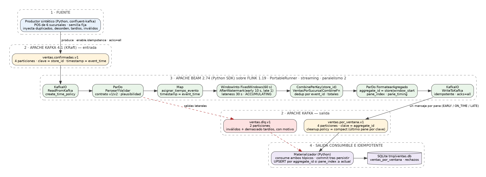

# Documento técnico — Ventas por sucursal y ventana con Kafka, Beam y Flink

Proyecto integrador · Streaming de datos y sus aplicaciones · Maestría en Inteligencia Artificial, FPUNA · Docente: Rodrigo Parra, M.Sc. · Septiembre de 2026

Autor: Germán Mereles, C.I. 4.419.136 (trabajo individual; detalle en [`integrantes.md`](integrantes.md)).

## 1. Problema, usuarios y decisiones que habilita

Una cadena minorista opera terminales de punto de venta (POS) en seis sucursales.
Cada venta confirmada produce un evento `sale.confirmed`. Los terminales siguen
vendiendo sin conectividad y reenvían en lote al reconectarse, y un POS que no
recibe la confirmación del broker reenvía el mismo evento. Por eso el flujo real
llega **desordenado**, con **retrasos** de segundos a minutos y con **duplicados**.

Pregunta de negocio: **¿cuánto vendió cada sucursal en cada ventana de tiempo
(monto total en guaraníes y cantidad de tickets), atribuyendo cada venta al
momento del pago?**

| Usuario del resultado | Qué necesita | Cómo lo obtiene |
|---|---|---|
| Tablero de gerencia | Ver la ventana en curso con pocos segundos de demora; acepta valores provisionales etiquetados. | Panes `EARLY` cada 10 s de processing time, `pane_timing` visible en la fila. |
| Reporte comparativo por sucursal y hora | Cada venta en la ventana en que ocurrió; tolera correcciones durante un período acotado. | Tiempo de evento, pane `ON_TIME` y panes `LATE` durante la lateness permitida; upsert por clave. |
| Conciliación contable | No perder ninguna venta, aunque llegue fuera del horizonte. | DLQ `ventas.dlq.v1` con `motivo=demasiado_tardio`, monto y `event_id`. |
| Operación del pipeline | Ver producción, consumo, procesamiento y errores. | Logs etiquetados del productor y del materializador, métricas Beam, UI de Flink, tabla `rechazos`. |

Escala de la demostración: ventana de 60 s y lateness de 30 s. Los mismos
parámetros (`WINDOW_SECONDS`, `ALLOWED_LATENESS_SECONDS`, `EARLY_FIRING_SECONDS`)
valen 3600 / 1800 / 300 en producción, donde la ventana es la hora comercial.

## 2. Arquitectura



| Componente | Tecnología | Función |
|---|---|---|
| Productor sintético | Python 3.12, `confluent-kafka` | Genera ventas reproducibles (semilla fija) para 6 sucursales × 3 POS y, de forma controlada, duplicados, desorden, tardíos aceptables, demasiado tardíos e inválidos. Modo `demo` (guion determinista) y modo `continuo` (tasas configurables). |
| Kafka | Apache Kafka 4.1.1, KRaft, un broker | Log durable de entrada (`ventas.confirmadas.v1`), salida compactada (`ventas.por_ventana.v1`) y DLQ (`ventas.dlq.v1`). |
| Pipeline | Apache Beam 2.74 (Python SDK) | Lectura con KafkaIO, validación con salidas laterales, asignación de tiempo de evento, ventana fija, `CombinePerKey` con deduplicación, formateo y escritura con KafkaIO. |
| Runner | Flink 1.19.3 (JobManager + 1 TaskManager con 4 slots), Beam Job Server `beam_flink1.19_job_server:2.74.0` | PortableRunner en modo **streaming**, paralelismo 2 (los 2 slots restantes permiten ejecutar el smoke test en paralelo), checkpoints `EXACTLY_ONCE` cada 30 s, estado en memoria (hashmap). Los SDK harness (Java para KafkaIO, Python para el pipeline) corren como procesos dentro del TaskManager (`environment_type=PROCESS`), sin Docker-in-Docker. |
| Materializador | Python, SQLite | Consume agregados y DLQ; `INSERT ... ON CONFLICT DO UPDATE` por `aggregate_id` condicionado a `pane_index` creciente; commit de offsets después de persistir. |
| Orquestación | Docker Compose, Makefile | `make up / demo / reporte / smoke / down`. |

Flujo de un evento: el POS confirma el pago → el productor publica en
`ventas.confirmadas.v1` con clave `store_id` y `timestamp = event_time` → KafkaIO
lo lee y deriva el watermark del timestamp → `ParsearYValidar` lo decodifica
(o lo desvía a la DLQ) → `asignar_tiempo_evento` fija el timestamp Beam en
`event_time` → `FixedWindows(60 s)` lo ubica en su ventana → `CombinePerKey`
lo suma una sola vez por `event_id` → cada disparo del trigger produce un pane
con `aggregate_id`, `pane_index` y `pane_timing` → `WriteToKafka` lo publica en
`ventas.por_ventana.v1` → el materializador hace upsert en SQLite.

## 3. Contrato de eventos, tópicos, claves, particiones y esquema de salida

### 3.1 Evento de entrada (`ventas.confirmadas.v1`)

```json
{
  "schema_version": 2,
  "event_id":   "S2-pos-01-000123",
  "event_type": "sale.confirmed",
  "event_time": "2026-09-21T14:23:05.120Z",
  "key":        "S2",
  "payload": {
    "store_id": "S2", "pos_id": "pos-01", "ticket_id": "T-S2-pos-01-000123",
    "amount_gs": 415000, "items": 3, "payment": "card", "channel": "store"
  }
}
```

| Campo | Decisión y justificación |
|---|---|
| `event_id` | `store-pos-secuencia`, generado en el POS antes de publicar: estable ante reintentos (el reenvío lleva el mismo id), único (la secuencia es por terminal) y legible. Es la clave de deduplicación. |
| `key` | `store_id`. Es la clave de negocio de la agregación y la clave de partición de Kafka: todos los eventos de una sucursal caen en la misma partición y se leen en orden de publicación. |
| `event_time` | Reloj del POS al confirmar el pago, ISO-8601 UTC. Es el tiempo de evento; el tiempo de procesamiento (`ingest_time`, `emitted_at`) se registra aparte y solo se usa para observabilidad y triggers tempranos. |
| `payload` | Lo necesario para validar (monto > 0, ítems > 0, medio de pago conocido, `store_id` coherente con `key`) y calcular (monto, ítems, medio de pago). |
| `schema_version` | Evolución **aditiva y compatible hacia atrás**: v2 agrega `payload.channel` (opcional, por defecto `store`). El decodificador acepta v1 y v2, completa valores por defecto (`upgrade_evento`) y rechaza versiones mayores (van a la DLQ con `version_no_soportada`). La versión viaja también como cabecera Kafka para filtrar sin deserializar. El productor emite ~20 % de eventos v1 para ejercitar la compatibilidad. |

Validación (`contratos.validar_evento`) y plausibilidad del reloj
(`ParsearYValidar`): `event_time` más de 2 min en el futuro o más de 24 h en el
pasado se rechaza (`reloj_futuro` / `reloj_pasado`) para que un reloj defectuoso
no contamine el watermark ni las ventanas.

### 3.2 Tópicos

| Tópico | Clave | Particiones | Configuración | Justificación |
|---|---|---|---|---|
| `ventas.confirmadas.v1` | `store_id` | 4 | `retention.ms=24h`, timestamp de registro = `event_time` | **Orden**: Kafka garantiza orden solo dentro de la partición; con `store_id` los eventos de una sucursal se leen en el orden en que se publicaron, lo que mantiene acotado el desorden que Beam debe absorber y permite en el futuro procesamiento con estado por sucursal. **Paralelismo**: 4 particiones fijan el máximo de lectores paralelos; el job usa paralelismo 2 (2 particiones por subtarea) y puede subir a 4 sin repartición. **Skew**: con 6 claves y pesos 30/25/15/15/10/5 % el reparto por `murmur2(store_id) mod 4` es desigual: en la demostración la partición 2 (S1+S3) recibió el 47 % de los mensajes y la partición 3 (S5) el 8 % (`evidencia/05_...`). Es aceptable para este volumen; si una sucursal dominara se pasaría a la clave `store_id|pos_id` (18 claves, conserva el orden por terminal), o se aumentaría el número de particiones antes de cargar datos. |
| `ventas.por_ventana.v1` | `aggregate_id` = `store_id|window_start` | 4 | `cleanup.policy=compact` | Cada pane es una nueva versión del mismo resultado; la compactación conserva el último valor por clave, de modo que el tópico se comporta como una tabla reconstruible (vista materializada). Un consumidor nuevo obtiene el estado completo leyendo desde el inicio. |
| `ventas.dlq.v1` | `key` original o `event_id` | 2 | `retention.ms=7d` | Mensajes inválidos y demasiado tardíos con `motivo`, `detalle`, `rechazado_en` y el mensaje original, para revisión y conciliación. |

Productor: `enable.idempotence=true`, `acks=all`, `linger.ms=20`, compresión snappy.
Los reintentos del cliente no duplican ni reordenan dentro de la partición.
El registro lleva `timestamp = event_time` porque KafkaIO deriva de él el watermark.

### 3.3 Esquema de salida (`ventas.por_ventana.v1` y tabla `ventas_por_ventana`)

```json
{
  "schema_version": 1,
  "aggregate_id": "S2|2026-09-21T14:23:00.000Z",
  "store_id": "S2",
  "window_start": "2026-09-21T14:23:00.000Z",
  "window_end":   "2026-09-21T14:24:00.000Z",
  "ticket_count": 12, "total_amount_gs": 4280000, "items": 31, "avg_ticket_gs": 356667,
  "by_payment_gs": {"card": 2100000, "cash": 1680000, "qr": 500000},
  "duplicates_discarded": 1,
  "pane_index": 2, "pane_timing": "LATE", "is_first": false, "is_last": false,
  "emitted_at": "2026-09-21T14:24:07.512Z"
}
```

`aggregate_id` es la clave estable del resultado; `pane_index` ordena las
versiones; `pane_timing` dice cómo debe leerse el valor (provisional, cerrado a
tiempo o corregido); `duplicates_discarded` evidencia la deduplicación.

## 4. Política temporal: ventanas, watermark, lateness, triggers y acumulación

| Pregunta | Decisión |
|---|---|
| **Qué** | Tickets, monto total, ítems, ticket promedio y monto por medio de pago, por sucursal. `CombinePerKey` con un `CombineFn` incremental (`VentasPorSucursalCombineFn`). |
| **Dónde (ventana)** | `FixedWindows(60 s)` alineada al minuto, intervalos `[inicio, fin)`. La pregunta es "qué ocurrió en cada período" y los períodos deben ser comparables entre sucursales y días. Se descartó la ventana deslizante (cada evento en varias ventanas, no coincide con el período del reporte) y la de sesión (no es la pregunta; exige fusiones). |
| **Cuándo (watermark)** | KafkaIO con `create_time_policy`: el watermark de cada partición es el máximo timestamp de registro (`event_time`) observado y, si la partición está ociosa, avanza con el reloj del sistema; el watermark del job es el mínimo entre particiones. Es heurístico: no promete que no lleguen datos más antiguos, y por eso existe la lateness. |
| **Cuándo (triggers)** | `AfterWatermark(early=AfterProcessingTime(10 s), late=AfterCount(1))`: pane `EARLY` cada 10 s de processing time mientras la ventana está abierta (tablero), pane `ON_TIME` cuando el watermark cruza el fin, un pane `LATE` por cada evento que llega dentro de la lateness. |
| **Lateness permitida** | `allowed_lateness=30 s` (30 min en producción): el estado de la ventana se conserva hasta `fin + 30 s`; cada tardío corrige el resultado. Supera el p99 asumido de la cola de terminales offline y acota el estado a dos ventanas abiertas por sucursal. |
| **Cómo (acumulación)** | `ACCUMULATING`: cada pane trae el total conocido hasta el momento. Permite un upsert simple en el sink (el último pane es la verdad) y evita retractaciones. |
| **Demasiado tardíos** | Beam descarta en silencio lo que llega después de `fin + lateness`. Para no perderlo, `ParsearYValidar` mantiene un watermark heurístico local (máximo `event_time` válido visto por el worker) y desvía a la DLQ con `motivo=demasiado_tardio` lo que queda más de `ventana + lateness` por detrás. Es una aproximación: la autoridad es el watermark de Beam; un evento en la zona gris puede ser descartado por Beam sin pasar por la DLQ (límite declarado en la sección 7). |

Clasificación de un evento al llegar, respecto del watermark `WM` y de su ventana `[ini, fin)`:

| Categoría | Condición | Tratamiento |
|---|---|---|
| A tiempo (incluye desordenados) | `WM < fin` | Se suma; aparece en `EARLY` y `ON_TIME`. |
| Tardío | `fin ≤ WM < fin + 30 s` | Se suma y dispara un pane `LATE` (`pane_index` mayor). |
| Demasiado tardío | `WM ≥ fin + 30 s` | DLQ con `demasiado_tardio` (heurístico) o descarte por Beam. |
| Duplicado | `event_id` ya en el acumulador de la ventana | No altera el total; incrementa `duplicates_discarded`. |
| Reloj implausible | `event_time > ahora + 2 min` o `< ahora − 24 h` | DLQ; no participa del watermark. |

Comportamientos observados del runner (evidencia en `evidencia/03_materializador.txt`):

- **Pane de cierre.** Tanto el DirectRunner (pruebas) como Flink emiten, al expirar la
  ventana (`fin + lateness`), un pane adicional con timing `LATE` e idéntico contenido
  al último; el sink lo absorbe por idempotencia (`panes_recibidos` lo cuenta).
- **Retraso del watermark.** En Flink el watermark derivado por KafkaIO avanza entre
  10 y 25 s por detrás del reloj de pared con tráfico continuo (el pane `ON_TIME` de
  la ventana `[23:58, 23:59)` se emitió a las 23:59:2x) y hasta 80 s cuando el
  tópico queda ocioso. Es la razón por la que el guion de demostración envía la
  venta tardía después de *observar* el pane `ON_TIME` en el tópico de salida, en
  lugar de fiarse del reloj. En producción (ventana de 60 min) este retraso es
  irrelevante.
- **Panes vacíos fuera de orden.** Si el watermark salta de golpe más allá de
  `fin + lateness` (por ejemplo, tras un período ocioso), Flink puede emitir para
  cada clave un pane `ON_TIME` vacío con `pane_index = 0` después del pane real;
  al terminar un job acotado (smoke test) el pane vacío llega incluso con el mismo
  `pane_index` que el real. La versión monótona `(ticket_count, pane_index)` del
  sink los descarta (`IGNORADO` en el log); es un caso real donde la idempotencia
  del sink evita corromper el resultado.

## 5. Deduplicación, idempotencia y semántica de entrega

**Deduplicación.** El acumulador del `CombineFn` guarda, por `event_id`, el monto,
los ítems y el medio de pago ya sumados; un `event_id` repetido no altera el
total y se cuenta en `duplicates_discarded`. Al fusionar acumuladores parciales
(*combiner lifting* en Flink) los solapamientos se descuentan. **Horizonte**: el
de la ventana, `fin + lateness` (90 s en la demo, 90 min en producción), que es
exactamente el período durante el cual un duplicado podría alterar un resultado
ya publicado. Un duplicado que llega después del horizonte cae en la categoría
"demasiado tardío" y no toca el resultado.

**Idempotencia de la salida.** Claves estables en dos niveles: en Kafka, el
tópico compactado conserva el último pane por `aggregate_id`; en SQLite, el
upsert solo aplica si la versión del pane no retrocede, con versión =
`(ticket_count, pane_index)`. En modo `ACCUMULATING` y sin retractaciones el
conteo de una ventana nunca decrece, así que es un reloj lógico más robusto que
`pane_index` solo: descarta panes viejos reproducidos, los panes vacíos con
`pane_index` repetido que Flink emite al expirar una ventana (observados en el
smoke test) y sobrevive a un reinicio del pipeline que reinicie los índices.
Releer el tópico desde el inicio, recibir un pane dos veces o recibir panes
fuera de orden deja la tabla en el mismo estado final (`test_materializador.py`
y `evidencia/07_idempotencia_replay.txt`).

**Semántica alcanzada por tramo (sin sobreprometer):**

| Tramo | Garantía | Mecanismo | Lo que no cubre |
|---|---|---|---|
| Productor → Kafka | Al menos una vez sin duplicados por reintento del cliente | `enable.idempotence`, `acks=all` | Reenvíos de la aplicación (POS que reenvía tras perder el ack): llegan como duplicados lógicos con el mismo `event_id` y los resuelve Beam. |
| Kafka → Beam/Flink | Al menos una vez; estado consistente con checkpoints `EXACTLY_ONCE` de Flink cada 30 s | Offsets como parte del checkpoint; `auto.offset.reset=earliest`; lectura vía SDF | Tras un reinicio se reprocesan los registros posteriores al último checkpoint; la deduplicación por `event_id` dentro del horizonte y la idempotencia del sink absorben la repetición. Probado reiniciando el TaskManager con el job en curso (`evidencia/10_tolerancia_fallos.txt`): Flink restauró el checkpoint y el flujo continuó. |
| Beam → Kafka (salida) | Al menos una vez | `WriteToKafka` con productor idempotente, sin transacciones Kafka | El mismo pane puede publicarse dos veces tras un fallo; es inocuo porque la clave y el `pane_index` son estables. |
| Kafka (salida) → SQLite | Efectivamente una sola vez | Upsert por `aggregate_id` con versión `(ticket_count, pane_index)` monótona; commit de offset después de persistir | Si el proceso muere entre el upsert y el commit, el mensaje se reprocesa y el upsert es un no-op. |

**No se afirma exactly-once end-to-end.** Lo que se garantiza es que el estado
final de `ventas_por_ventana` es el mismo con o sin reentregas, reinicios o
relecturas, y que ninguna venta válida se pierde en silencio: o está en el
resultado o está en la DLQ con su motivo.

## 6. Pruebas y evidencia

| Nivel | Herramienta | Escenarios cubiertos |
|---|---|---|
| Unitarias de contrato y lógica | `pytest` | v1 → v2, nueve motivos de rechazo estables, `CombineFn` con duplicados y fusión de acumuladores, sink idempotente, determinismo del productor. |
| Ventanas y tiempo de evento | `TestPipeline` + `TestStream` (DirectRunner streaming) | Pane `ON_TIME` al cruzar el watermark; evento tardío dentro de la lateness → pane `LATE` con el total corregido; evento fuera de la lateness → descartado (sin pane); duplicado tardío → pane `LATE` con el mismo total y `duplicates_discarded` incrementado; evento desordenado dentro de la ventana → absorbido sin pane extra. |
| Salidas laterales | `TestPipeline` (lote) | JSON corrupto, reloj futuro y payload incompleto van a `invalido`; un evento 210 s por detrás del máximo visto va a `muy_tardio`; el que está a 89 s (dentro del horizonte de 90 s) se agrega. |
| Smoke end-to-end | `scripts/smoke.py` sobre Docker | Tópicos efímeros; 50 ventas + 3 duplicados + 1 demasiado tardío + 3 inválidos; pipeline acotado (`max_num_records`); materialización; verifica tickets únicos = 50, duplicados descartados = 3, DLQ con 1 `demasiado_tardio` y 3 rechazos de contrato. |
| Demostración | `make up`, `make demo`, `make reporte` | Guion determinista con siete fases (normales, duplicados, desorden, tardío, demasiado tardío, inválidos, normales) observado en logs, UI de Flink y SQLite. Resultado de la corrida documentada: 302 mensajes publicados; 18 filas de salida; `S1|23:58` pasó de 35 tickets (`ON_TIME`) a 36 (`LATE`) por la venta tardía; 3 duplicados descartados; 7 rechazos con motivo, incluido el demasiado tardío. |
| Tolerancia a fallos | Reinicio del TaskManager en caliente | El job se restauró desde el último checkpoint y siguió materializando ventanas; los panes reemitidos no alteraron el estado. |
| Idempotencia | Segundo consumidor con grupo nuevo | Releer ambos tópicos desde el inicio produce exactamente el mismo estado (18 filas, 7 rechazos) aunque la compactación ya eliminó parte de los panes. |

La evidencia de la ejecución real (salidas capturadas sin edición) está en
[`evidencia/`](evidencia/); el archivo `evidencia/README.md` la describe. La
demostración en video del recorrido completo está en
<https://youtu.be/n5L7Zlr4Tjo>; el guion seguido es [`guion_demo.md`](guion_demo.md).

## 7. Límites conocidos, supuestos y mejoras

Supuestos: relojes de los POS sincronizados por NTP (desvío < 30 s); retardo
normal POS → Kafka de segundos; cola de terminales offline por debajo de la
lateness en el p99; una sola zona horaria; solo ventas confirmadas (anulaciones y
devoluciones quedan fuera, por lo que los totales de una ventana solo crecen).

Límites:

- Un broker, un JobManager y un TaskManager, sin replicación ni alta
  disponibilidad; el estado de las ventanas está en memoria con checkpoints
  locales al contenedor. Un despliegue real usaría tres brokers con
  `min.insync.replicas=2`, RocksDB y checkpoints en almacenamiento durable.
- El productor sintético es reproducible pero no es un replay de datos
  históricos; el contrato y el pipeline no cambiarían con una fuente real.
- La clasificación de "demasiado tardío" en `ParsearYValidar` es heurística y
  local al worker (se reinicia con el proceso); Beam sigue siendo quien decide
  con su watermark y puede descartar sin pasar por la DLQ en la zona gris.
  La versión definitiva usaría el contador `droppedDueToLateness` del runner o un
  `DoFn` con estado y timers que conozca el watermark.
- `WriteToKafka` no usa transacciones Kafka: un pane puede publicarse dos veces
  tras un fallo (inocuo por idempotencia, pero visible en `panes_recibidos`).
- Los panes `EARLY` dependen del processing time; su cadencia no es
  reproducible entre ejecuciones (los `ON_TIME` y `LATE` sí lo son).
- SQLite es un sink de demostración; en producción sería una base con
  `UPSERT` nativo (PostgreSQL) o un almacén clave-valor alimentado por el tópico
  compactado.

Mejoras posibles: deduplicación con estado y timers y horizonte independiente de
la ventana (`Deduplicate` de Beam); métricas exportadas a Prometheus/Grafana
(retraso de ingesta, panes por tipo, rechazos por motivo); replay de un dataset
histórico con control de velocidad; vista deslizante adicional para detectar
picos; modelado de anulaciones con retractaciones o con montos negativos por
`ticket_id`.

## 8. Reproducibilidad

Todo se ejecuta con Docker Compose desde el README: `make up` construye las
imágenes (la de aplicación cachea el JAR del servicio de expansión de KafkaIO en
tiempo de build; la de Flink incluye los SDK harness de Beam como procesos),
crea los tópicos con sus configuraciones, envía el job y arranca el
materializador. `make demo` reproduce siempre el mismo guion (semilla fija) y
`make smoke` verifica automáticamente el recorrido completo. No hay pasos
manuales.
